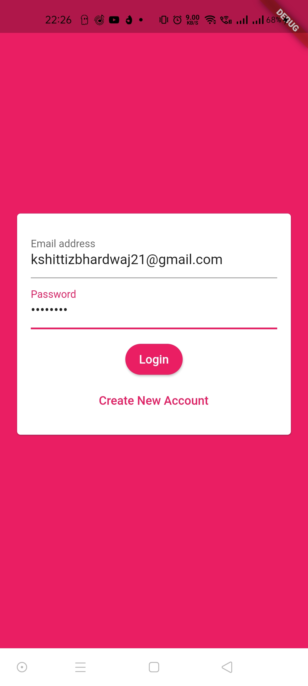
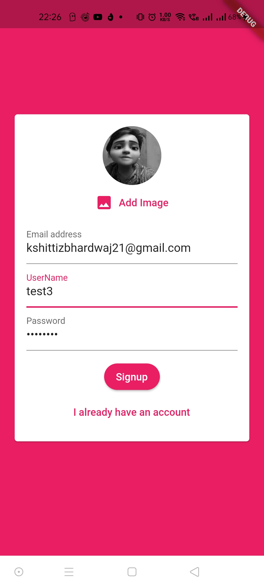
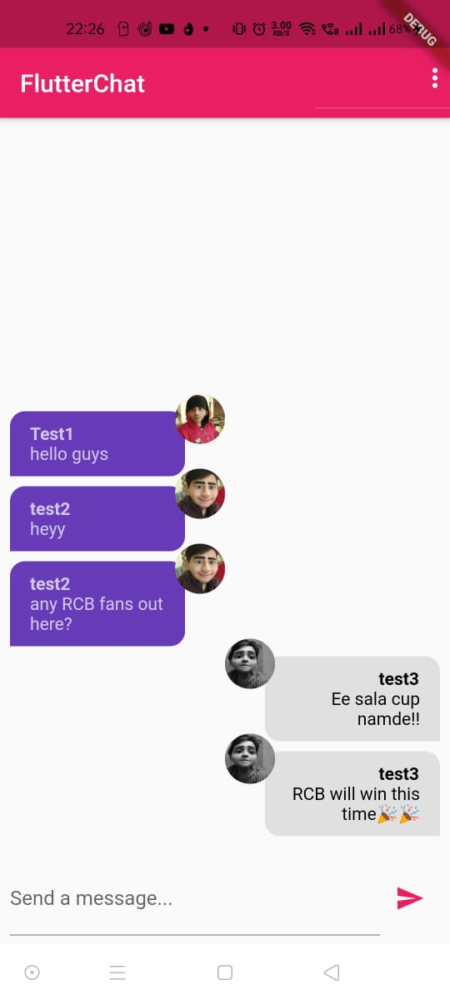

# Chat App

- This is a demo mobile application which is like a chat room which allows multiple authenticated users to chat at the same time with each other.

- I have used Firebase for user Authentication and storing User data including images taken using camera/gallery.

- I created this app just for education purpose to learn how to implement authentication using Firebase that too with a clean code as here I have used packages like firebase_auth, firebase_storage and firebase_messenging which make our code clean and easy to understand.

## Images

#### Login Screen

#### Sign Up Screen

#### Home Screen

